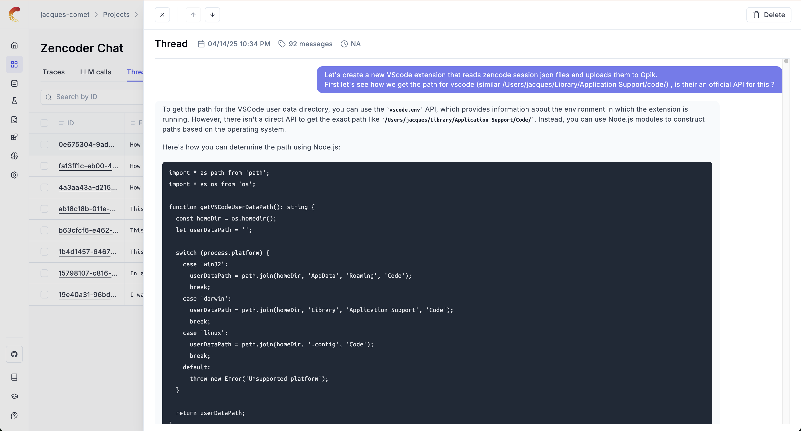

# Zencoder - Opik Chat History

> 💻: This extension was created in an evening with the help of Zencoder itself ! As such, it might not be the most polished extension ever made but it works ! If you have any feedback or suggestions, feel free to reach out on the Opik Github repository.

The `Zencoder - Opik Chat History` extension for VSCode will allow you to save your Zencoder chat sessions into Opik. You can share these chat sessions with your team or even on Twitter / X if you are so inclined ! Your vibe coding session no longer need to be private !

Learn more about:
- [Opik](https://github.com/comet-ml/opik) is an Open-Source LLM evaluation platform that allows you to keep track of all your LLM chat conversations in one place.
- [Zencoder](https://zencoder.ai/) is an AI coding agent that can be used as a VSCode extension, no need to install yet another IDE just to get access to the best AI tools out there.

## Installation

To install the installation, navigate to the extensions tab and search for "Zencoder - Opik Chat History". Click on the extension name and then click Install.

**Configuration:**

To configure the extension, open up VSCode settings (Ctrl + ,), find the setting called "Zencoder - Opik Chat History: Opik API Key", and enter your Opik API key. You can create a free Opik account at [https://www.comet.com/signup](https://www.comet.com/signup?from=llm).

## Usage

Once installed, there is nothing for you to do ! Just sit back and enjoy your coding experience knowing that all your chat history is saved in Opik ...